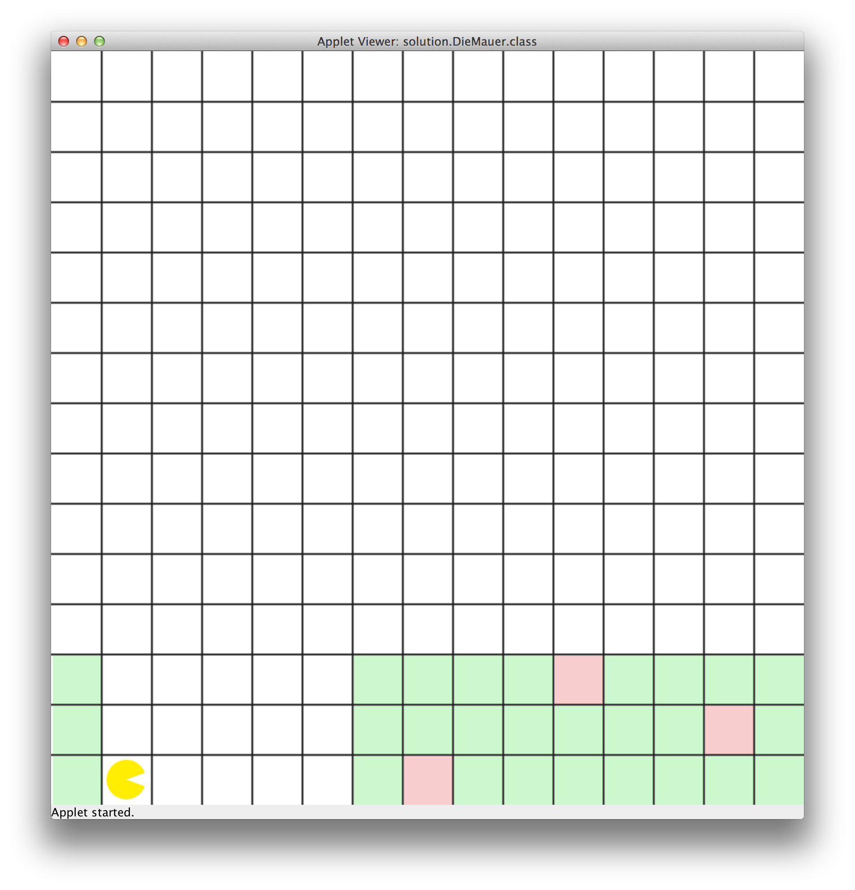
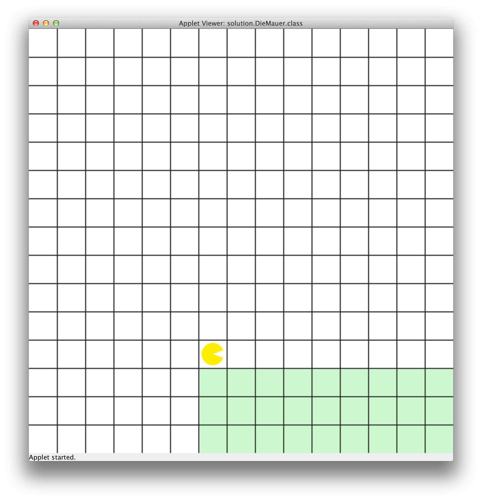

# U06 | Bouncer repariert eine Mauer

## Ausgangslage

| Die beschädigte Mauer und der Stapel mit Ersatzteilen. | Die Mauer nachdem sie repariert wurde |
|:-----:|:-----:|
|  |  |

## Aufgabe

In dieser Aufgabe soll Bouncer eine Mauer reparieren. Höhe der Mauer und
Anzahl der beschädigten Felder sind dabei unbekannt. Bouncer weiß nur,
dass die linke Seite der Mauer - die erste Spalte - immer intakt ist.
Intakte Teile der Mauer sind grün eingefärbt, die zu reparierenden
Felder rot. Zur Reparatur steht Bouncer ein ausreichend großer Stapel an
*Ersatzsteinen* zur Verfügung. Bouncers Aufgabe ist es, die Mauer nach
den beschädigten Felder abzusuchen. Findet er ein solches Felder,
repariert er es. Dazu muss er zum Stapel mit den Ersatzteilen laufen
einen Stein aufnehmen und mit diesem die beschädigte Stelle reparieren.
Dabei wird immer der oberste Stein ausgewählt. Wenn Bouncer mit einem
neuen Stein zur Mauer zurückkehrt, läuft er direkt in die *Zeile*, in
der er die beschädigte Stelle gefunden hat.

Da wir mit Bouncer einen solchen Prozesse nur simulieren können, müssen
Sie ein wenig Phantasie mitbringen: Das Reparieren eines Feldes passiert
durch das Einfärben der Stelle mit grüner Farbe. Das Aufnehmen eines
Steines vom Stapel können Sie durch das Löschen der grünen Farbe an
dieser Stelle darstellen (`bouncer.clearFieldColor()`). Alle
Arbeitsabläufe sollen sichtbar am Bildschirm dargestellt werden.

**Hinweise:** Wenn Sie dieses Problem gemäß der Aufgabenstellung lösen
wollen, werden Sie merken, dass es sich um ein komplexes Programm
handelt. Möglicherweise können Sie den nötigen Algorithmus auf Basis
Ihres aktuellen Wissens nicht aufstellen. Es handelt sich explizit um
eine optionale Aufgabe, an der Sie *tüfteln* können.

Als Hilfestellung können Sie von folgenden Teilproblemen ausgehen, die
im Rahmen des Programms gelöst werden müssen.

1.  Bouncer muss von der Startposition bis zur Mauer gelangen, diese
    reparieren und am Ende auf der Mauer zum stehen kommen.

2.  Für die Reparatur untersucht Bouncer die Mauer *zeilenweise*. Findet
    er eine beschädigte Stelle, beginnt er mit der Reparatur.
    Anschließend setzt er die Untersuchung der Mauer fort.

3.  Die Reparatur besteht aus mehreren Schritten: Bouncer muss zum
    Stapel laufen und dort einen Stein aufnehmen. Danach kehrt er in die
    *Zeile* der Mauer zurück, in der die beschädigte Stelle gefunden
    wurde und repariert diese. Dabei soll er direkt in die entsprechende
    Zeile zurückkehren und nicht jedes mal die komplette Mauer
    durchlaufen müssen.

4.  Bouncer muss sich den Weg zur aktuellen Zeile merken. Denken Sie
    daran, dass er Felder farbig markieren und auch wieder *entfärben*
    kann. Versuchen Sie den jeweils korrekten Weg zwischen Mauerzeile
    und Stapel mit dieser Methodik zu kennzeichnen.
